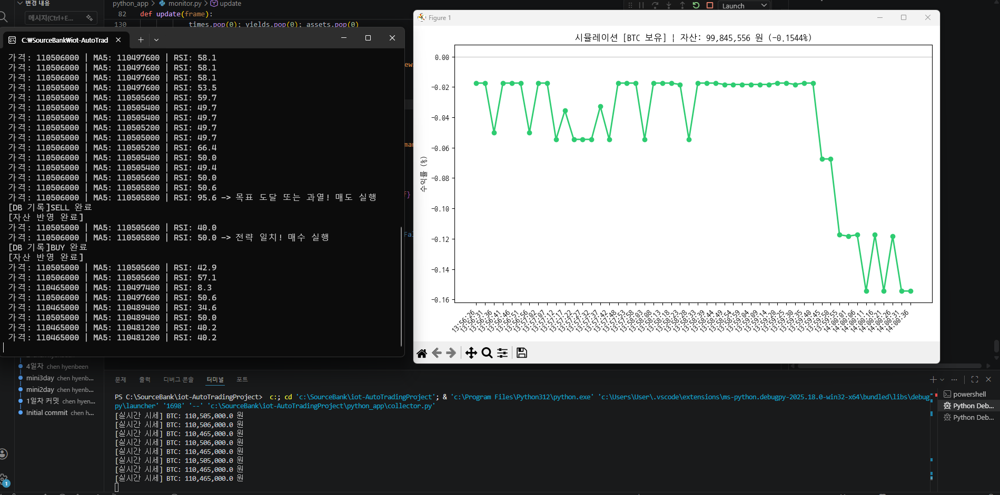
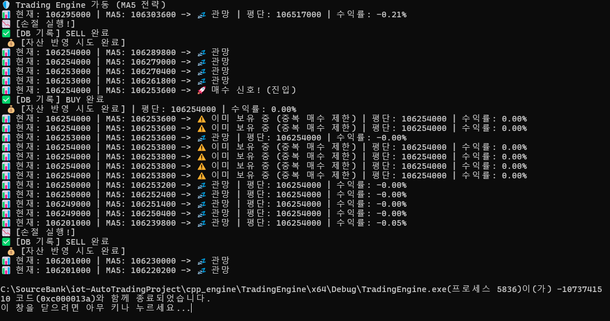
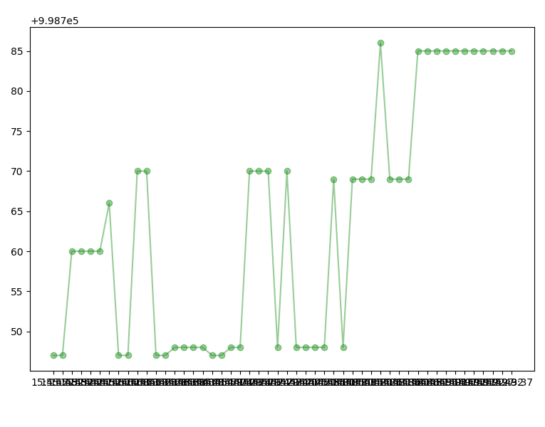

## iot-AutoTradingProject
2026년 Iot개발 miniProject 1

## 프로젝트명: C++ 기반 비트코인 퀀트 트레이딩 엔진 및 실시간 모니터링 시스템
------------------------------------------------------
1. 프로젝트 개요
    - 개발 목적: 실시간 시장 데이터를 분석하여 최적의 매매 타점을 결정하고, 이를 자동으로 실행 및 기록하는 무중단 트레이딩 시스템 구축.
    - 개발기간; 7일 (단기 집중 프로젝트)
    - 주요 기술 스택:
      - 언어: C++ (매매 엔진), Python (데이터 수집 및 시각화)
      - 데이터베이스: MySQL (시장 데이터 및 매매 로그 관리)
      - 라이브러리: Upbit API, OpenCV(이미지 처리), Matplotlib(시각화), MySQL Connector

2. 핵심 구현 기술
    - C++ 전략 고도화 (Strategy Engine)
      - RSI 필터 구현: 단순 가격 비교를 넘어 RSI(Relative Strength Index) 지표를 직접 구현하여 시장의 과열 상태를 진단.
      - Multi-Condition 전략:
        - 매수: 5일 이동평균선(MA5) 돌파 + RSI 60 이하 (안전 진입)
        - 매도: 목표 수익률 도달 또는 RSI 70 이상 (과열 해소)
      - 객체지향 설계: DatabaseManager와 StrategyEngine 클래스 분리를 통해 코드의 재사용성과 유지보수성 확보.

    - 실시간 데이터 파이프라인 및 시각화
      - Python 수집기: Upbit API를 활용해 실시간 시세를 초단위로 수집하고 MySQL에 동기화.
      - 실시간 모니터링 Dashboard: matplotlib.animation을 활용해 5초 주기로 자산 변동성 및 가격 흐름을 시각화.
      - Y축 포맷팅 및 가독성: 지수 표기법을 제거하고 실제 원화(KRW) 단위로 표기하여 직관성 향상.

3. 주요 기능 및 안정성 
    - 매매 타점 마킹 (Trade Point Marking):
      - 차트 위에 매수(▲), 매도(▼) 지점을 자동 마킹하여 전략의 정확도를 시각적으로 검증.
    - 로그 및 스냅샷 자동화:
      - 매매 발생 시점의 차트를 .png 파일로 자동 저장하고, 모든 이력을 .csv로 아카이빙하여 사후 분석 데이터 확보.
    - 시스템 생존력 (Fault Tolerance):
      - DB 연결 유실 시 자동 재접속(Retry) 로직 구현.
      - try-except 및 예외 처리를 통한 24시간 무중단 구동 안정성 확보.

 4. 프로젝트 성과 및 배운 점  
    - 성과: 초기 자산 대비 수익률(ROI) 실시간 트래킹 성공 및 안정적인 자동 매매 사이클 완성.
    - 배운 점
        - C++를 활용한 고성능 연산 및 클래스 설계 능력 배양.
        - 서로 다른 언어(C++, Python)가 하나의 DB를 공유하며 협업하는 시스템 아키텍처 이해.
        - 네트워크 장애 및 데이터 예외 상황에 대비하는 실전적인 예외 처리 기술 습득.

- 최종결과



### 알고리즘 기반 '주식/가상화폐 자동 매매 시뮬레이션

1. 시스템 구조 (Architecture)
  - Language: C++ (Main Engine), Python (Data Collector)
  - Database: MySQL 
  - Library: libmysql, WinSock2 (Network), Windows.h (System)
  -Pattern: OOP (Object-Oriented Programming) 기반 모듈화

2. 주요 기능 (Key Features)
실시간 데이터 연동: Python으로 수집된 업비트 시세를 MySQL을 통해 실시간으로 읽어옴.

- 이동평균선(MA5) 전략: 최근 5회차 가격 평균을 계산하여 현재가와 비교하는 추세 추종 매매.

- 자동 자산 관리: 매수/매도 시 assets 테이블의 원화(CASH)와 비트코인(BTC) 잔고를 실시간 업데이트.

- 매매 일지 자동 기록: 모든 거래 내역(가격, 시간, 종류)을 trade_logs 테이블에 자동 저장.

- 리스크 관리 로직:
  - 익절(Take-Profit): 설정 수익률(예: +0.01%) 도달 시 자동 매도.

  - 손절(Stop-Loss): 설정 수익률(예: -0.01%) 도달 시 자동 매도.

  - 중복 매수 방지: 코인 보유 중일 경우 추가 매수 금지 로직 포함.

3. 모듈화 현황 (Refactoring)
- DatabaseManager 클래스 구현:

  - 기존 main.cpp에 밀집되어 있던 SQL 쿼리와 DB 접속 로직을 분리.
 
  - DatabaseManager.h / .cpp 파일을 통해 DB 접근을 객체화하여 유지보수성 향상.

- Main Logic 간소화: main.cpp는 매매 전략과 루프 제어에만 집중하도록 설계.
2. 시스템 아키텍처 (전체 구조)
시스템은 크게 세 부분으로 나누어 설계하면 효율적입니다.

- 수집기 (Python): yfinance나 pyupbit 같은 라이브러리를 사용해 실시간 시세를 가져와 DB에 쌓거나 C++로 넘겨줍니다.

- 엔진 (C++): Python이 받은 데이터를 넘겨받아 이동평균선(MA), RSI 등 지표를 계산하고 "살지 팔지" 결정합니다.

- 저장소 (DB - MySQL/PostgreSQL): 자산 현황, 매수 기록, 일별 수익률을 정규화하여 관리합니다.

3. 단계별 구현 가이드

- 1단계: 데이터베이스(DB) 설계
가장 먼저 데이터가 들어갈 그릇을 만들어야 합니다. SQL 실력을 발휘할 시점입니다.

- Table 1: market_data (날짜, 종목코드, 현재가, 거래량)

   - Table 2: trade_logs (매매 시간, 종목, 수량, 가격, 수수료)

    - Table 3: assets (보유 현금, 총 자산 가치, 수익률)

- 2단계: C++ 연산 로직 (알고리즘)
C++에서는 속도가 중요한 기술적 지표 계산을 담당합니다.

    - 자료구조 활용: 시세 데이터를 담을 std::vector나 실시간 윈도우 계산을 위한 std::deque를 활용해 보세요.

    - 알고리즘: 이동평균선(Moving Average) 계산 로직을 작성합니다.

    - 예: 최근 5일 평균 가격이 20일 평균 가격을 돌파할 때(골든크로스) 매수 신호 발생.

- 3단계: Python과 C++ 연동 (핵심)
가장 난이도가 높으면서도 실력이 급상승하는 구간입니다.
    - 방법: C++ 코드를 .dll(Windows) 또는 .so(Linux) 파일로 빌드한 뒤, Python의 ctypes 라이브러리를 사용하여 호출합니다.

    - 흐름: Python에서 API로 가격을 가져옴 → C++ 함수 호출(가격 전달) → C++이 계산 후 "Buy/Sell/Hold" 결과 반환 → Python이 결과에 따라 DB 업데이트.

### 데이터베이스 스키마 (ERD) 구조
1. 관계도 요약 (ERD Concept)
우리 시스템의 데이터는 다음과 같은 흐름을 가집니다.

market_data: 실시간 시세를 저장 (수집기의 결과물)

trade_logs: 매매 결정을 기록 (엔진의 행동 기록)

assets: 현재 내 주머니 사정 (최종 결과물)

2. 테이블 상세 설계 (Table Specifications)
레포트에는 아래 표 형식을 그대로 넣으시면 전문성이 확 올라갑니다.

1. `market_data (시세 정보)`

| 컬럼명 | 데이터 타입 | 제약 조건 | 설명 |
| :--- | :--- | :--- | :--- |
| id | INT | PK, AI | 고유 식별 번호 |
| ticker | VARCHAR(20) | NOT NULL | 종목 코드 (KRW-BTC) |
| price | DECIMAL(18,4) | NOT NULL | 수집된 현재가 |
| timestamp | DATETIME | DEFAULT | 데이터 수집 시간 |

2. `trade_logs (매매 일지)`

| 컬럼명 | 데이터 타입 | 제약 조건 | 설명 |
| :--- | :--- | :--- | :--- |
| id | INT | PK, AI | 거래 고유 ID |
| side | VARCHAR(10) | NOT NULL | 매수(BUY) / 매도(SELL) |
| price | DECIMAL(18,4) | NOT NULL | 체결 가격 |
| volume | DECIMAL(18,8) | NOT NULL | 체결 수량 |
| timestamp | DATETIME | DEFAULT | 거래 발생 시간 |

3. `assets (자산 현황)`

| 컬럼명 | 데이터 타입 | 제약 조건 | 설명 |
| :--- | :--- | :--- | :--- |
| asset_type | VARCHAR(20) | Primary Key | 자산 종류 (CASH, BTC) |
| balance | DECIMAL(18,8) | NOT NULL | 현재 보유 잔고 |
| avg_price | DECIMAL(18,4) | DEFAULT 0 | 매수 평단가 |
| last_update | DATETIME | ON UPDATE | 최종 갱신 시각 |


### 2026-04-03 1일차

- 1단계: 파이썬 DB 연결 라이브러리 설치 (가장 먼저!)

```bash
pip install pymysql python-dotenv
```

## 2026-04-06 2일차 

### 시스템 인프라 구축 및 이종 언어 연동 성공

- 오늘 데이터의 흐름(Data Pipeline)을 완성하는 데 집중했습니다. 파이썬이 데이터를 공급하고, C++이 이를 분석하는 구조를 실제 작동 확인했습니다.

#### 1. 데이터베이스(MySQL) 상세 설정
- **Database**: `AutoTrading` 생성 (Charset: `utf8mb4`)
- **Table**: `market_data` 테이블 구축 완료 
    - 실시간 시세 저장을 위한 ID, Ticker, Price, Timestamp 구조 설계

#### 2. python 시세 수집기 (collector) 구현
- `pyupbit` 라이브러리를 활용한 비트코인(KRW-BTC) 실시간 시세 추출.
- `.env` 파일을 통한 DB 보안 설정 및 `pymysql`을 이용한 데이터 저장 로직 구현.
- **성과** 5초 주기 업비트 시세를 MySQL DB에 자동 적재 성공.

#### 3. C++ 매매 판단 엔진 (Trading Engine) 구축
- **환경 설정**: Visual Studio 2026 (x64) 환경에서 `libmysql` 라이브러리 연동 성공.
- **핵심 로직**: 
    - MySQL C API를 이용해 DB에 접속하여 최신 가격 데이터 2개를 조회.
    - 현재가와 이전 가격을 비교하여 **상승/하락/보합** 상태를 판단하는 알고리즘 초안 작성,
- **Troubleshooting**: `libmysql.dll` 누락 문제를 실행 폴더 복사를 통해 해결.

#### 4. 시스템 연동 확인 (Integration Test)
- **Flow**: [Python] 시세 수집 → [MySQL] 데이터 저장 → [C++] 데이터 조회 및 전략 판단
- **결과**: 두 프로그램이 동시에 돌아가며 실시간으로 매매 신호(`🚀 상승!`, `📉 하락`)를 출력하는 것을 확인.

## 3일차

- [ ] **실제 매매 로그 기록**: C++에서 상승 신호 발생 시 `trade_logs` 테이블에 INSERT 실행. 
- [ ] **자산 관리 로직**: 초기 자본 설정 및 매수 시 `assets` 테이블 업데이트 기능 추가.
- [ ] **전략 고도화**: 단순 가격 비교를 넘어 '이동평균선(MA)' 계산 로직 구현 시작.

### ✅ 오늘의 성과
- **실시간 자산 업데이트 로직 완성**:
  - 매수 신호 발생 시 `assets` 테이블에서 `CASH` 잔액을 차감하고 `BTC` 보유 수량을 즉각 반영하는 트랜잭션 구현.
  - SQL `ON DUPLICATE KEY UPDATE` 구문을 활용하여 코인 보유량 합산 로직 최적화.
- **실시간 수익률(ROI) 산출 엔진 구현**:
  - `trade_logs` 테이블의 과거 매수 기록을 분석하여 **매수 평균 단가(Avg Price)** 산출.
  - 현재 시세와 평단가를 비교하여 실시간 수익률을 콘솔 및 DB에 출력하는 기능 추가.
- **DB 정합성 해결**:
  - `autocommit` 설정 및 `COMMIT` 명령을 통한 데이터 영구 저장 이슈 해결.
  - `asset_type`의 PK(Primary Key) 특성을 활용한 데이터 중복 방지.

### 📊 현재 구동 화면
> `📊 현재: 103,491,000 | 이전: 103,491,000 -> ➡️ 보합 | 평단가: 103,408,785원 | 수익률: 0.08%`
> (실시간으로 자산 가치를 평가하며 안정적으로 구동 중)

### 🔍 Troubleshooting & Lessons Learned
1. **함수 호출 누락 및 로직 흐름 개선**:
   - 문제: 자산 업데이트 함수를 정의했으나 매수 조건문 내 호출 누락으로 DB 미반영.
   - 해결: `checkMarketAndDecide` 내 조건부 호출 로직을 점검하여 매매 시점과 자산 업데이트 시점 동기화.
2. **DB 대소문자 구분 및 데이터 무결성 확보**:
   - 문제: 'CASH'와 'cash'의 혼용으로 인한 `UPDATE` 쿼리 실패.
   - 해결: DB 데이터와 소스코드 내 문자열을 대문자로 표준화하여 쿼리 정확도 향상.
3. **트랜잭션 영속성 확보**:
   - 문제: 프로그램 종료 시 데이터 휘발 현상 발생.
   - 해결: `mysql_autocommit` 활성화 및 명시적 `COMMIT` 명령을 통해 데이터 영속성(Persistence) 확보.

## 4일차

### 오늘의 최종 성과 요약
  - C++: 함수 분리(Refactoring)로 코드의 안정성 확보
  - JSON: 공용 설정 파일로 시스템 관리 편의성 증대
  - Python: 실시간 자산 모니터링 시각화 성공

- 잔고 확인 로직 (Balance Check)
  - 기능: 매수 주문 실행 전, DB의 assets 테이블을 조회하여 실제 매수 가능한 CASH 잔액이 있는지 검증합니다.
  - 효과: 잔액 부족으로 인한 SQL 오류를 방지하고, 무분별한 매수 시도를 차단합니다.

- 중복 매수 방지 (Anti-Double-Buy)
  - 기능: 현재 BTC를 보유 중인지 체크하여, 이미 코인이 있다면 추가 매수 신호가 와도 진입을 제한합니다
  - 효과: 한 번의 상승장에 자산이 몰빵되는 것을 방지하고, 정해진 비중(0.001 BTC 등)으로만 매매하도록 관리합니다.

- 자동 청산 및 자산 반영 (Auto-Exit & Sync)
  - 기능: 매수 후 실시간 수익률(ROI)을 계산하여 익절(+2.0%) 또는 손절(-1.0%) 기준 도달 시 자동으로 매도(SELL)를 실행합니다.
  - 효과: 매매 즉시 assets 테이블의 현금과 코인 잔고를 실시간 업데이트하여 데이터 정밀도를 유지합니다.

  ### 결과
  
  ```
  | ID | Ticker | Side | Price | Volume | Timestamp |
  | :--- | :--- | :--- | :--- | :--- | :--- |
  | 1 | KRW-BTC | BUY | 106,517,000 | 0.001 | 2026-04-08 01:15 |
  | 2 | KRW-BTC | SELL | 106,295,000 | 0.001 | 2026-04-08 01:27 |
  | 3 | KRW-BTC | BUY | 106,254,000 | 0.001 | 2026-04-08 01:27 |
  | 4 | KRW-BTC | SELL | 106,201,000 | 0.001 | 2026-04-08 01:28 |
  ```
2. 주요 기능 (Key Features)
실시간 데이터 연동: Python으로 수집된 업비트 시세를 MySQL을 통해 실시간으로 읽어옴.

- 이동평균선(MA5) 전략: 최근 5회차 가격 평균을 계산하여 현재가와 비교하는 추세 추종 매매.

- 자동 자산 관리: 매수/매도 시 assets 테이블의 원화(CASH)와 비트코인(BTC) 잔고를 실시간 업데이트.

- 매매 일지 자동 기록: 모든 거래 내역(가격, 시간, 종류)을 trade_logs 테이블에 자동 저장.

- 리스크 관리 로직:
  - 익절(Take-Profit): 설정 수익률(예: +0.01%) 도달 시 자동 매도.

  - 손절(Stop-Loss): 설정 수익률(예: -0.01%) 도달 시 자동 매도.

  - 중복 매수 방지: 코인 보유 중일 경우 추가 매수 금지 로직 포함.

3. 모듈화 현황 (Refactoring)
- DatabaseManager 클래스 구현:

  - 기존 main.cpp에 밀집되어 있던 SQL 쿼리와 DB 접속 로직을 분리.
  - DatabaseManager.h / .cpp 파일을 통해 DB 접근을 객체화하여 유지보수성 향상.
- Main Logic 간소화: main.cpp는 매매 전략과 루프 제어에만 집중하도록 설계.

  [안정성 강화(예외 처리)]
  ```
  1. C++ 코드 리팩토링 (기초 공사)
  작업 내용: main.cpp에 몰려있던 코드를 get_total_asset, update_balance 등 기능별 함수로 분리.

  분류: 2️⃣ 시스템 안정성 및 최적화 (Stability)

  효과: * 가독성 향상: 코드가 깔끔해져서 어디가 틀렸는지 찾기 쉬워짐.

  재사용성: 나중에 다른 기능을 추가할 때 만들어둔 함수를 그대로 쓸 수 있음.

  안정성: 한 부분의 수정이 전체 시스템을 망가뜨릴 위험을 줄임.

  2. 환경 설정의 외부화 (공용 설계도)
  작업 내용: DB 접속 정보 등을 코드에 직접 쓰지 않고 config.json 파일로 분리.

  분류: 3️⃣ 시각화 및 관리 (Visualization & Config)

  효과: * 보안: 소스 코드를 공유해도 내 비번은 공개되지 않음.

  협업: C++ 엔진과 Python 모니터가 똑같은 정보를 공유해서 사용하게 함.

  3. 실시간 모니터링 시스템 구축 (결과물)
  작업 내용: Python의 matplotlib을 이용해 자산 변화 그래프 구현.

  분류: 3️⃣ 시각화 및 관리 (Visualization & Config)

  효과: * 시각화: 숫자로만 보던 자산을 한눈에 들어오는 그래프로 확인 가능.

  실시간 감시: 엔진이 잘 돌아가는지 매번 DB를 뒤져보지 않아도 됨.

  ```


  


1️⃣ 전략 고도화 (Intelligence)
[v] 기술적 지표 도입: 이동평균선(MA5, MA20) 추세 추종 구현 완료.

[v] 자동 손절/익절: 수익률 기반 자동 매도 로직 구현 완료.

[v] 변동성 돌파 전략: 래리 윌리엄스 전략 이식 완료.

2️⃣ 시스템 안정성 및 최적화 (Stability)
[v] 코드 리팩토링: main.cpp 함수 분리 및 구조화 완료. (유지보수성 향상)

[ ] 예외 처리: API/DB 재접속 로직 강화 (다음 목표)

3️⃣ 시각화 및 관리 (Visualization & Config)
[v] 실시간 대시보드: Python 기반 실시간 자산 그래프 구현 완료.

[v] 환경 설정 파일화: config.json을 통한 C++ & Python 설정 공유 완료.
```
pip install pandas matplotlib mysql-connector-python
```
---

## 🛠️ 기술 스택
- **Language**: C++ (Core Engine), Python (Data Collector)
- **Database**: MySQL 8.0
- **Environment**: Windows 11, Visual Studio 2022
- **Library**: `libmysql`, `requests` (Python)
---------------------------------------------

1. 시스템 안정성 강화 (Stability) - 가장 우선순위!
[ ] DB 재접속 로직 추가: monitor.py나 main.cpp가 켜져 있을 때, 잠깐 네트워크가 끊겨도 에러로 종료되지 않고 다시 연결을 시도하는 코드를 넣어야 합니다.

[ ] 로그 기록 시스템 (Logging): 단순히 화면에 출력하는 것을 넘어, trade_log.txt 같은 파일에 매매 기록과 에러 발생 시점을 자동으로 저장하게 만듭니다.

2. 시각화 및 관리 고도화 (Visualization)
[ ] 수익률 표시 추가: 현재 그래프 상단 제목에 자산 금액만 나오는데, 이를 "총 수익: +5.2% (50,000원)" 식의 수익률 정보가 함께 나오도록 업데이트합니다.

[ ] 실시간 매매 타점 표시: 그래프에 단순히 선만 긋는 게 아니라, 매수가 일어난 지점에는 빨간 점, 매도가 일어난 지점에는 파란 점이 찍히도록 개선합니다.

3. 전략 및 실행 최적화 (Intelligence)
[ ] 슬리피지(Slippage) 계산: 실제 매수하려던 가격과 체결된 가격의 차이를 기록하여 전략의 오차를 줄이는 로직을 검토합니다.

[ ] 텔레그램 알림 연동 (선택): 매매가 발생할 때마다 휴대폰 텔레그램으로 "비트코인 매수 완료!" 같은 메시지가 오도록 설정하면 PC를 계속 안 봐도 됩니다.

내일 새 채팅방에 입장하자마자 **복사해서 바로 붙여넣으실 수 있는 "최종 요약본"**입니다. 이 내용을 주시면 제가 프로젝트의 모든 맥락을 한 번에 파악하고 바로 다음 단계로 안내해 드릴게요.

📋 [복사용] 프로젝트 진행 현황 요약
1. 프로젝트 개요

내용: C++ 트레이딩 엔진 + Python 실시간 모니터링 시스템

구조: * cpp_engine/TradingEngine/: 메인 엔진 (C++)

python_app/: 시계열 자산 그래프 및 데이터 수집 (Python)

database/: MySQL 기반 마켓 데이터 및 자산 관리

공용 설정: config.json 파일을 C++과 Python이 공유하여 사용함.

2. 오늘(4/8) 완료된 주요 성과 (v 표시 항목)

[v] C++ 코드 리팩토링: main.cpp 내 로직을 get_total_asset, update_balance 등 함수 단위로 분리하여 안정성 확보.

[v] 실시간 대시보드 구현: monitor.py 실행 시 5초 주기로 DB를 조회하여 자산 변화를 그래프로 시각화 성공.

[v] 설정 파일 외부화: 경로 문제(FileNotFoundError)를 해결하고, os.path를 이용해 어느 위치에서든 config.json을 읽어오도록 경로 최적화 완료.

3. 현재 작동 상태

데이터 흐름: collector.py(가격 수집) → DB → TradingEngine.exe(매매/잔고 업데이트) → monitor.py(자산 시각화)

최종 확인 결과: 실시간 자산 그래프(999,666 KRW 등)가 정상적으로 출력되는 것 확인 완료.

4. 내일(4/9) 진행할 목표

시스템 생존력 강화: DB 연결 유실 시 자동 재접속(Retry) 로직 추가.

시각화 고도화: 그래프 상단 수익률(%) 표시 및 매매 타점(Buy/Sell) 마킹 기능 검토.

## 5일차

1. `시각화 고도화`
- 수익률(%) 자동계산, Y지수 표기법 제거, 실시간 차트 업데이트
  - 수익률(ROI) 실시간 계산: 초기 자본 대비 자산 변동을 %로 자동 계산하여 상단 타이틀에 노출합니다.
  - 가독성 개선: 축 눈금의 지수 표기법(Scientific Notation)을 제거하고, 실제 원화(KRW) 단위로 표기하여 직관성을 높였습니다.
  - Dynamic Update: matplotlib.animation을 활용하여 5초 간격으로 차트를 갱신, 실시간 시장 상황을 반영합니다.

2. `매매 타점 마킹` (Trade Point Marking)
- DB 연동 시각화: trade_logs 테이블의 데이터를 조회하여 실제 매수가와 매도가 발생한 시점을 차트 위에 표시합니다.

직관적인 인터페이스:

  - Red Triangle (^): 매수(BUY) 지점 표시

  - Blue Inverted Triangle (v): 매도(SELL) 지점 표시

- 이를 통해 전략(MA5 골든크로스 등)이 의도한 타점에서 정확히 실행되었는지 사후 검증이 가능합니다.

3. `시스템 생존력 및 안정성` (Reliability)
- Fault Tolerance: 데이터베이스 연결 유실 시 시스템이 멈추지 않도록 자동 재접속(Retry) 로직을 구현했습니다.

- Exception Handling: try-except 블록을 통해 네트워크 불안정이나 DB 타임아웃 상황에서도 프로세스가 강제 종료되지 않고 생존하도록 설계했습니다.

4. `로그 및 스냅샷 자동화` (Logging Automation)
- 이벤트 트리거 저장: 새로운 매매가 감지될 때마다 현재 차트의 상태를 .png 파일로 자동 스냅샷 저장합니다.

- `CSV 데이터 아카이빙`: 모든 매매 이력은 파일 형태(trade_history.csv)로 누적 기록되어, 추후 데이터 분석 및 전략 수정의 기초 자료로 활용됩니다.

5. C++ 전략 고도화: RSI 필터 만들기
  - 완료된 고도화 항목 체크리스트
    - 데이터 다각화: 현재가(current)뿐만 아니라 DB에서 최근 15개의 가격을 리스트(vector)로 긁어오는 로직 완성.
  - 수학적 지표 구현: StrategyEngine 클래스를 통해 RSI 수식을 C++로 정확히 구현.
  - 복합 매매 조건
    - 매수: MA5 돌파(추세) + RSI 60 이하(안전 구간) → 추격 매수 방지 로직.
    - 매도: 익절 목표 도달 + RSI 70 이상(과열 구간) → 위험 감지 탈출 로직.
  - 객체지향 설계: DatabaseManager와 StrategyEngine을 분리하여 유지보수가 쉬운 구조로 안착.

  


-MA5(5일 이동평균선)의 역할은 한마디로 **"가격의 울퉁불퉁한 잔파도를 깎아서 부드러운 흐름(추세)을 보여주는 것"**입니다.

단순히 5개의 평균을 냈다는 수치보다, 트레이딩에서는 다음과 같은 심리적/기술적 의미로 사용됩니다.

1. 단기 추세의 '나침반'
비트코인 가격은 1초에도 수십 번씩 위아래로 튑니다(노이즈).

가격 > MA5: 현재 힘이 평균보다 강하다는 뜻입니다. 즉, **"지금은 오르는 중(상승 추세)"**이라고 판단합니다.

가격 < MA5: 현재 힘이 평균보다 약해졌다는 뜻입니다. 즉, **"지금은 떨어지는 중(하락 추세)"**이라고 봅니다.

사용자님 코드에서 if (current > ma5)일 때 매수하게 만든 이유도, **"지금 상승 흐름을 탔으니 올라타자!"**라는 전략인 거죠.

2. 지지선과 저항선
신기하게도 많은 트레이더가 MA5를 보고 매매하기 때문에, 가격이 떨어지다가도 MA5 근처에 오면 다시 튕겨 올라가는 '지지' 현상이 일어납니다. 반대로 올라가다가 MA5를 뚫지 못하고 내려오는 '저항' 현상도 생깁니다.


