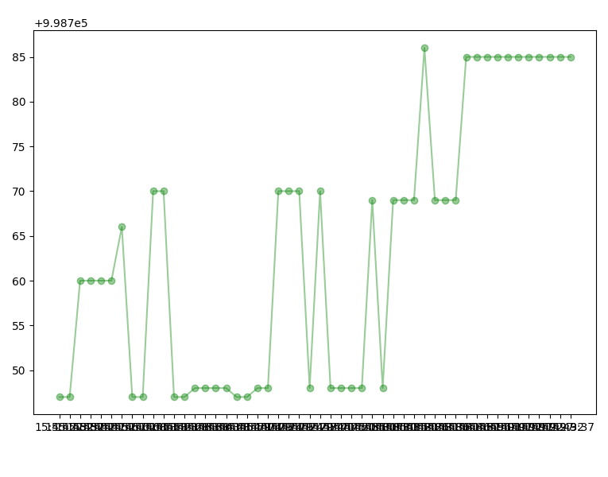
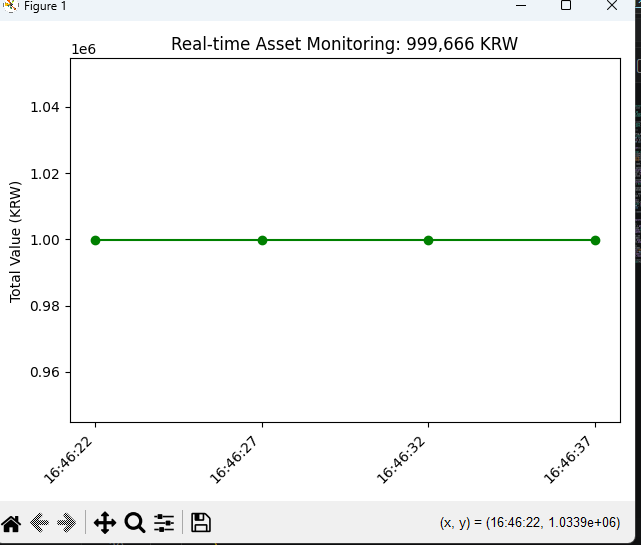
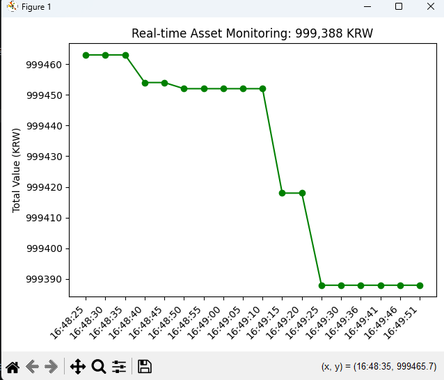
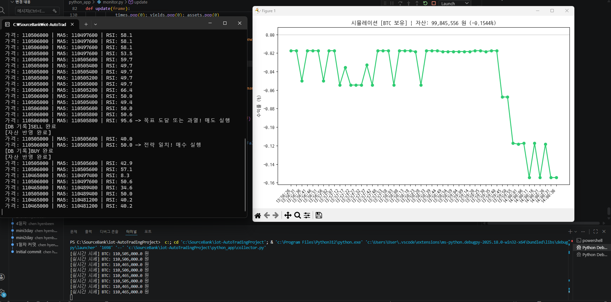
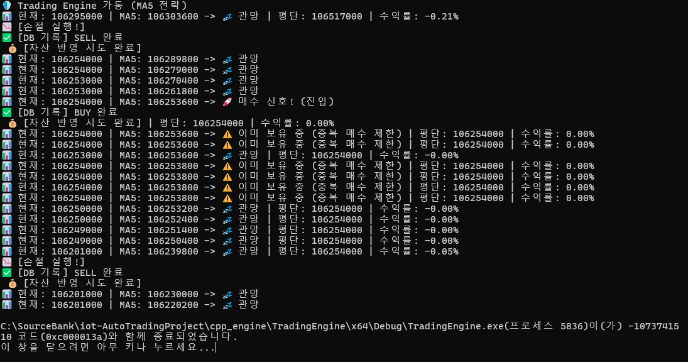

# C++ Quant Trading Engine

C++ 기반 비트코인 퀀트 트레이딩 엔진 및 실시간 모니터링 시스템

---

## 프로젝트 소개

실시간 비트코인 시세를 수집하고, 이동평균선(MA)과 RSI 지표를 이용해 매매 여부를 판단하는 자동 매매 시스템입니다.

C++로 매매 로직을 구현하고, Python으로 실시간 시세 수집과 자산 시각화를 담당하도록 구성했습니다. 두 프로그램은 MySQL 데이터베이스를 공유하며 데이터를 주고받는 구조로 설계했습니다.

이 프로젝트를 통해 객체지향 설계, 데이터베이스 연동, 실시간 데이터 처리, 서로 다른 언어를 함께 사용하는 시스템 구성을 경험했습니다.

## 주요 기능

- 실시간 비트코인 시세 수집
- 이동평균선(MA), RSI 기반 매매 판단
- 거래 내역 및 자산 정보 저장
- 자산 변화 실시간 시각화
- 객체지향 구조(DatabaseManager, StrategyEngine) 적용

## 프로젝트 특징

- Python으로 실시간 비트코인 시세를 수집하여 MySQL에 저장
- C++에서 저장된 데이터를 조회하여 이동평균선(MA)과 RSI를 기반으로 매매 여부를 판단
- 매수·매도 결과와 자산 정보를 데이터베이스에 저장
- Python으로 자산 변화와 거래 내역을 그래프로 확인할 수 있는 대시보드 구현
- DatabaseManager와 StrategyEngine으로 역할을 분리하여 유지보수가 쉽도록 구성

## 시스템 아키텍처

시스템은 크게 세 부분으로 구성됩니다.

```
[Python] 수집기 (Collector)
   │  pyupbit API로 실시간 시세 수집 → MySQL 저장
   ▼
[MySQL] 저장소 (market_data / trade_logs / assets)
   │  자산 현황, 매수 기록, 일별 수익률 정규화 관리
   ▼
[C++] 엔진 (TradingEngine)
   │  MA5, RSI 등 지표 계산 → 매수/매도/보유 판단 → 자산·로그 반영
   ▼
[Python] 모니터 (monitor.py)
   matplotlib.animation으로 5초 주기 자산·매매 타점 시각화
```

**데이터 흐름**: `collector.py`(가격 수집) → `DB` → `TradingEngine.exe`(매매 판단/잔고 업데이트) → `monitor.py`(자산 시각화)

## 기술 스택

| 구분 | 내용 |
| :--- | :--- |
| Language | C++ (매매 엔진), Python (데이터 수집 및 시각화) |
| Database | MySQL 8.0 |
| Environment | Windows 11, Visual Studio 2022 |
| Library (C++) | `libmysql`, `WinSock2`, `Windows.h` |
| Library (Python) | `pyupbit`, `pymysql`, `python-dotenv`, `pandas`, `matplotlib`, `mysql-connector-python`, `requests` |
| Pattern | OOP(객체지향 프로그래밍) 기반 모듈화 |

## 프로젝트 구조

```
├── cpp_engine/
│   └── TradingEngine/       # 매매 판단 메인 엔진 (C++)
│       ├── main.cpp         # 프로그램 실행 및 매매 루프
│       ├── DatabaseManager.h/.cpp   # DB 접속 및 쿼리 담당
│       └── StrategyEngine.h/.cpp   # 이동평균선, RSI 계산 및 매매 판단
├── python_app/
│   ├── collector.py         # 실시간 시세 수집기
│   └── monitor.py           # 실시간 자산/매매 타점 시각화 대시보드
├── database/                # MySQL 스키마 및 마켓 데이터/자산 관리
└── config.json               # C++ / Python 공용 설정 파일 (DB 접속 정보 등)
```

- `config.json`을 통해 DB 접속 정보 등을 코드에서 분리, C++ 엔진과 Python 모니터가 동일한 설정을 공유합니다.

## 핵심 기능

### C++ 전략 엔진 (Strategy Engine)

매매 전략은 이동평균선(MA5)과 RSI 지표를 함께 사용하도록 구현했습니다.

- 최근 가격 데이터를 이용해 MA5와 RSI를 계산
- MA5를 기준으로 단기 추세를 판단
- RSI 값을 함께 확인하여 매수와 매도 조건을 결정
- 목표 수익률과 손절 조건을 적용하여 자동으로 매매를 수행
- 동일한 종목을 반복해서 매수하지 않도록 중복 매수 방지 로직을 추가

### 자산 및 매매 로그 관리

- 매수와 매도 결과를 데이터베이스에 저장
- 자산 정보를 실시간으로 업데이트
- 거래 내역을 trade_logs 테이블에 기록
- 평균 매수가와 현재 가격을 이용해 수익률 계산

### 실시간 데이터 파이프라인
- Python 수집기가 Upbit API로 초단위 시세를 수집해 MySQL에 동기화
- C++ 엔진이 최신 시세를 조회하여 지표 계산 및 매매 판단 수행

## Database (ERD)

시스템 데이터는 `market_data`(시세 수집) → `trade_logs`(매매 기록) → `assets`(현재 자산 현황) 순으로 흐릅니다.

**1. `market_data` (시세 정보)**

| 컬럼명 | 데이터 타입 | 제약 조건 | 설명 |
| :--- | :--- | :--- | :--- |
| id | INT | PK, AI | 고유 식별 번호 |
| ticker | VARCHAR(20) | NOT NULL | 종목 코드 (KRW-BTC) |
| price | DECIMAL(18,4) | NOT NULL | 수집된 현재가 |
| timestamp | DATETIME | DEFAULT | 데이터 수집 시간 |

**2. `trade_logs` (매매 일지)**

| 컬럼명 | 데이터 타입 | 제약 조건 | 설명 |
| :--- | :--- | :--- | :--- |
| id | INT | PK, AI | 거래 고유 ID |
| side | VARCHAR(10) | NOT NULL | 매수(BUY) / 매도(SELL) |
| price | DECIMAL(18,4) | NOT NULL | 체결 가격 |
| volume | DECIMAL(18,8) | NOT NULL | 체결 수량 |
| timestamp | DATETIME | DEFAULT | 거래 발생 시간 |

**3. `assets` (자산 현황)**

| 컬럼명 | 데이터 타입 | 제약 조건 | 설명 |
| :--- | :--- | :--- | :--- |
| asset_type | VARCHAR(20) | Primary Key | 자산 종류 (CASH, BTC) |
| balance | DECIMAL(18,8) | NOT NULL | 현재 보유 잔고 |
| avg_price | DECIMAL(18,4) | DEFAULT 0 | 매수 평단가 |
| last_update | DATETIME | ON UPDATE | 최종 갱신 시각 |

## Trading Strategy

매매 전략은 이동평균선(MA5)과 RSI를 함께 사용하도록 구현했습니다.

- 최근 가격을 이용해 MA5를 계산하여 단기 추세를 판단
- RSI를 이용해 과매수·과매도 구간 확인
- MA5와 RSI 조건을 모두 만족하면 매수
- 목표 수익률 또는 손절 조건에 도달하면 자동 매도
- 동일한 종목을 반복 매수하지 않도록 중복 매수 방지 로직 적용

**RSI 필터 도입 결과 (매수 시점 스냅샷)**



## Dashboard

Python과 matplotlib을 이용하여 거래 결과를 확인할 수 있는 대시보드를 구현했습니다.

- 5초마다 데이터베이스를 조회하여 그래프 갱신
- 현재 자산과 수익률 표시
- 매수와 매도 시점을 그래프에 표시
- 거래 내역을 CSV 파일로 저장

**실시간 자산 모니터링 그래프 (초기 구현 재현)**



**1분 단위 자산 변동 그래프**



## 실행 방법

**1. 패키지 설치**
```bash
pip install pymysql python-dotenv pandas matplotlib mysql-connector-python
```

**2. 데이터베이스 준비**
- MySQL에 `AutoTrading` 데이터베이스 생성 (Charset: `utf8mb4`)
- `market_data`, `trade_logs`, `assets` 테이블 생성 (ERD 참고)

**3. 공용 설정 파일 작성**
- `config.json`에 DB 접속 정보 등을 작성하여 C++ 엔진과 Python 스크립트가 공유하도록 설정

**4. 순서대로 실행**
```bash
# 1) 시세 수집기 실행
python python_app/collector.py

# 2) C++ 매매 엔진 실행 (Visual Studio 빌드 후)
cpp_engine/TradingEngine/TradingEngine.exe

# 3) 실시간 모니터링 대시보드 실행
python python_app/monitor.py
```

## 결과 화면

**최종 결과 화면**



- C++ 엔진에서 실시간 시세를 조회하여 매매 결과를 출력
- Python 대시보드에서 자산 변화와 수익률을 실시간으로 확인
- 거래 내역은 MySQL에 저장되고 CSV 파일로 기록

- 실시간 매매 신호 콘솔 출력 예시
```
📊 현재: 103,491,000 | 이전: 103,491,000 -> ➡️ 보합 | 평단가: 103,408,785원 | 수익률: 0.08%
```

- 매매 로그 (`trade_logs`) 예시

| ID | Ticker | Side | Price | Volume | Timestamp |
| :--- | :--- | :--- | :--- | :--- | :--- |
| 1 | KRW-BTC | BUY | 106,517,000 | 0.001 | 2026-04-08 01:15 |
| 2 | KRW-BTC | SELL | 106,295,000 | 0.001 | 2026-04-08 01:27 |
| 3 | KRW-BTC | BUY | 106,254,000 | 0.001 | 2026-04-08 01:27 |
| 4 | KRW-BTC | SELL | 106,201,000 | 0.001 | 2026-04-08 01:28 |

- 실시간 자산 그래프에서 999,666 KRW 등 자산 변동이 정상적으로 시각화됨을 확인

## Trouble Shooting

| 문제 | 원인 | 해결 |
| :--- | :--- | :--- |
| `libmysql.dll` 누락 | 실행 폴더에 DLL 미배치 | 실행 폴더로 DLL 복사하여 해결 |
| 함수 호출 누락 | 자산 업데이트 함수 정의 후 매수 조건문 내 호출 누락 | `checkMarketAndDecide` 내 조건부 호출 로직 점검, 매매 시점과 자산 업데이트 시점 동기화 |
| DB 대소문자 불일치 | `'CASH'`와 `'cash'` 혼용으로 `UPDATE` 쿼리 실패 | DB 데이터와 소스코드 문자열을 대문자로 표준화 |
| 트랜잭션 미영속 | 프로그램 종료 시 데이터 휘발 | `mysql_autocommit` 활성화 및 명시적 `COMMIT` 처리 |
| 설정 파일 경로 오류 | `config.json` 위치에 따라 `FileNotFoundError` 발생 | `os.path`를 이용해 실행 위치와 무관하게 경로 탐색하도록 최적화 |
| 엔진 비정상 종료 | `TradingEngine.exe` 구동 중 손절 매도 및 중복 매수 제한 로직 반복 처리 이후 종료 코드 `0xc000013a`로 프로세스 강제 종료 발생 | 원인 파악 및 예외 처리 보강 필요 (다음 개선 항목으로 이관) |

**엔진 콘솔 로그 (비정상 종료 사례)**



## 회고

이번 프로젝트를 진행하면서 C++과 Python을 함께 사용하는 구조를 직접 구현해 볼 수 있었습니다.

처음에는 자동 매매 기능을 구현하는 것이 목표였지만, 개발을 진행하면서 데이터베이스 설계, 객체지향 구조, 실시간 데이터 처리, 예외 처리 등 다양한 요소가 함께 필요하다는 것을 배웠습니다.

또한 DatabaseManager와 StrategyEngine으로 역할을 분리하면서 코드를 조금 더 유지보수하기 쉬운 구조로 개선하는 경험도 할 수 있었습니다.

이번 프로젝트를 통해 하나의 프로그램을 만드는 것보다 여러 구성 요소를 연결하여 하나의 시스템을 구성하는 과정에 흥미를 느꼈습니다.

앞으로는 테스트 코드 작성, 예외 처리 보완, 다양한 매매 전략 추가 등을 통해 프로젝트를 계속 발전시켜 보고 싶습니다.

## 향후 개선 사항

**시스템 안정성 강화**
- [ ] DB 재접속 로직 고도화: 네트워크 순단 시에도 프로세스가 종료되지 않고 재시도하도록 개선
- [ ] 로그 기록 시스템: 콘솔 출력을 넘어 `trade_log.txt` 등 파일로 매매/에러 이력 자동 저장
- [ ] `TradingEngine.exe` 비정상 종료(`0xc000013a`) 원인 분석 및 예외 처리 보강

**시각화 및 관리 고도화**
- [ ] 그래프 상단에 자산 금액과 함께 수익률(%) 정보(예: "총 수익: +5.2% (50,000원)") 병기
- [ ] 매수/매도 지점을 그래프에 실시간으로 마킹하는 기능 추가 개선

**전략 및 실행 최적화**
- [ ] 슬리피지(Slippage) 계산: 주문가와 체결가의 차이를 기록해 전략 오차 분석
- [ ] 텔레그램 알림 연동: 매매 발생 시 텔레그램 메시지로 실시간 알림 전송 (선택)